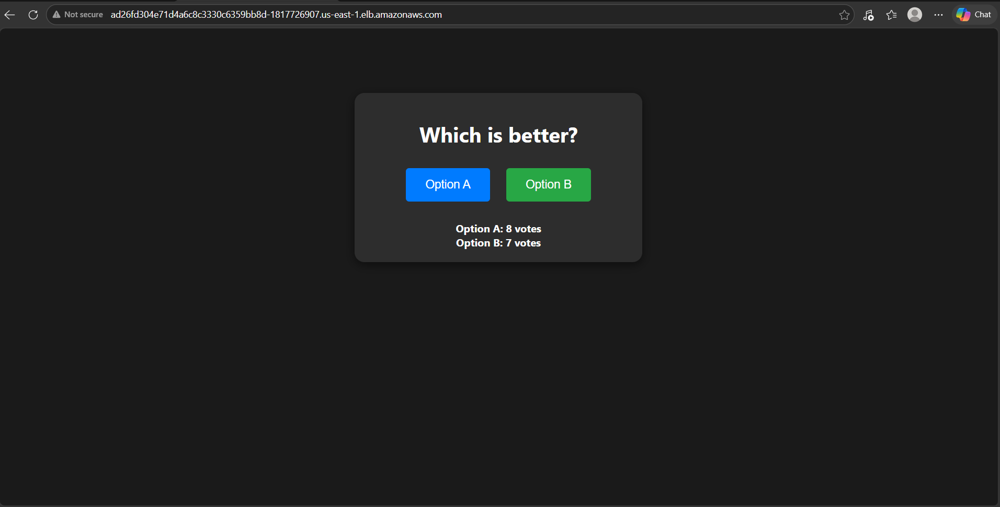
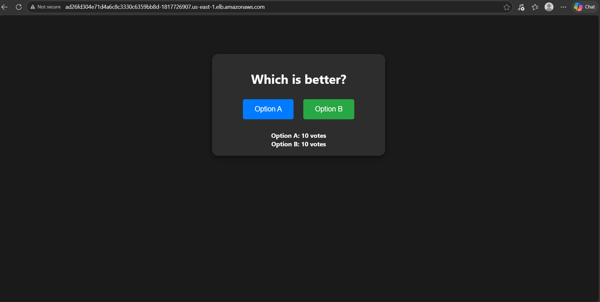
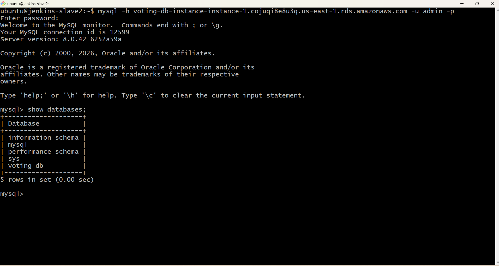
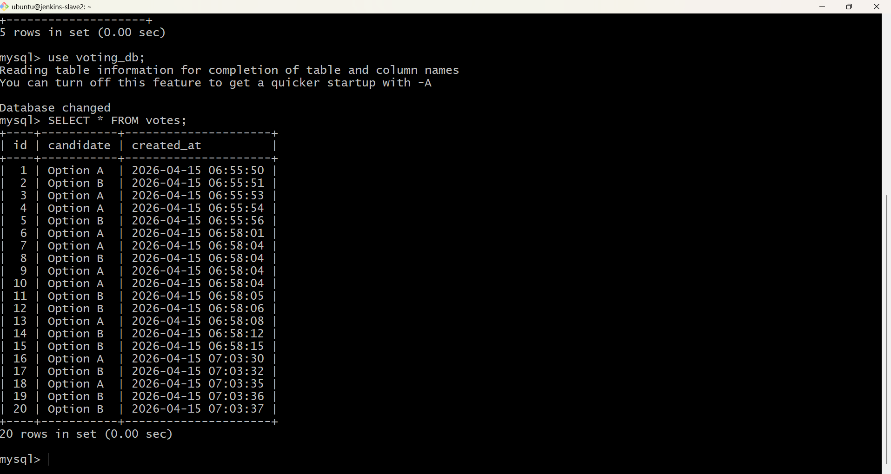

## End-to-End Automated Cloud Voting System: Jenkins CI/CD on AWS EKS & RDS

### Overview
A fully automated CI/CD pipeline that builds and deploys a Node.js microservice into an Amazon EKS cluster with a load-balanced frontend.
The system ensures high availability and data persistence by integrating stateless Kubernetes pods with a private Amazon RDS (MySQL) instance, secured via custom VPC Security Groups and IAM Access Entries.

### Architecture

### App homepage

